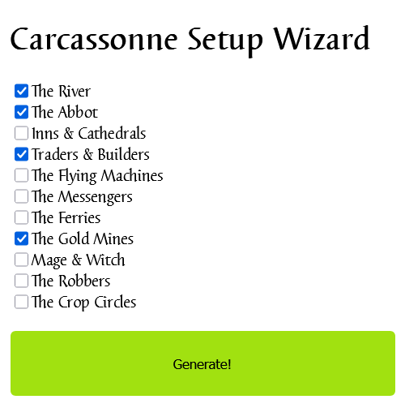
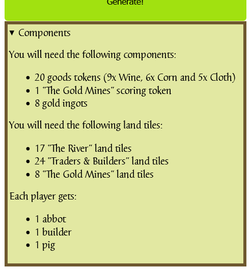

# Carcassonne Setup Wizard [WIP]
> **NOTE**: This tool is still a Work In Progress

The **Carcassonne Setup Wizard** is a tool for easily setting up and putting away Carcassonne when playing with multiple expansions.

## 🌟Features
- Support for multiple expansions
- Ease of use
- Carcassonne-themed interface

## 📃How to use

The Wizard works in 3 simple steps:
1. **Select** what expansions you want to play with by checking the boxes
2. **Press** the "Generate!" button
3. **See** what components you need and how to set up the game

